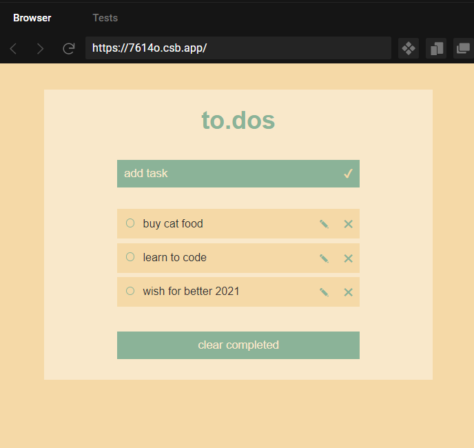

# to.dos

## General info

very very simple to do app with React hook UseReducer

## Screenshots



## Technologies

- React - version 17.0.0

## Code Example

```
function reducer(todos, action) {
  switch (action.type) {
    case ACTIONS.ADD_TODO:
      return [...todos, newTodo(action.payload.name)];

    case ACTIONS.TOGGLE_TODO:
      const newTodos = todos.map((todo) => {
        if (todo.id === action.payload.id) {
          return { ...todo, complete: !todo.complete };
        }
        return todo;
      });
      newTodos.sort((a, b) => a.complete - b.complete);
      return newTodos;
```

## Inspiration

Many thanks to Kyle from Web Dev Simplified
